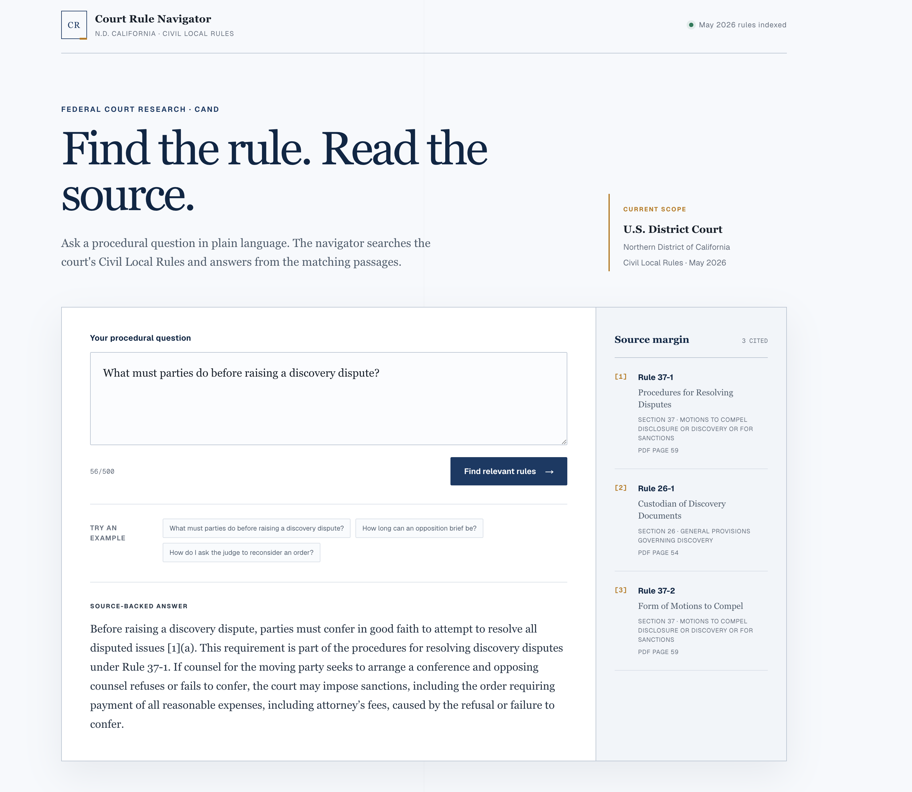

# Court Rule Navigator

Court Rule Navigator is a small legal research application for the Civil Local Rules of the U.S. District Court for the Northern District of California.

You can ask a procedural question in normal language. The application searches the court rules, sends the relevant passages to a local language model, and shows an answer with the rule numbers and PDF pages used.

This is a learning and portfolio project. It is not a legal advice tool.

## Demo ⛓️ 🔗 https://www.youtube.com/watch?v=KOJjT8eQRWg

[](https://www.youtube.com/watch?v=KOJjT8eQRWg)

Click the image to watch the demo on YouTube.

## Why I built it

I wanted to understand how a RAG application works with a real legal document instead of starting with already-clean sample data.

The difficult part was not calling a language model. It was preparing the PDF correctly: finding the real rule pages, separating individual rules, preserving section information, splitting long rules into useful chunks, and keeping enough source information to verify an answer.

## What is included

The current version works with one document:

- Court: Northern District of California
- Document: Civil Local Rules
- Version: May 2026
- PDF pages: 81
- Parsed rules: 115
- Searchable passages: 256

The source document is listed in [`sources/documents.json`](sources/documents.json). The PDF itself is downloaded locally and is not committed to the repository.

## How a question is answered

1. The PDF is read one page at a time.
2. Printed page labels and individual rule headings are detected.
3. Each rule is saved with its title, section, status, text, and page range.
4. Long rules are split into smaller passages. A small overlap keeps related text together at chunk boundaries.
5. Ollama creates an embedding for every passage.
6. The embeddings are stored in PostgreSQL using pgvector.
7. A user's question is also converted into an embedding.
8. The closest rule passages are retrieved. Unrelated questions are rejected using a similarity threshold.
9. When a question names a section such as "motion practice," section metadata helps narrow the search before ranking the passages.
10. The retrieved passages are sent to the chat model, which writes a short answer from those sources.

This pattern is called retrieval-augmented generation, or RAG. The language model does not receive the whole PDF. It receives only the passages selected by the search step.

## Tech stack

- TypeScript
- Next.js App Router
- React
- PostgreSQL
- pgvector
- Drizzle ORM
- PDF.js
- Ollama
- `embeddinggemma:300m-qat-q4_0` for embeddings
- `qwen3:1.7b` for answers

## Running it locally

### Requirements

Install these before starting:

- Node.js 20 or newer
- pnpm
- PostgreSQL with the pgvector extension available
- Ollama

### 1. Install the project

```bash
pnpm install
```

### 2. Create the environment file

```bash
cp .env.example .env.local
```

Update `DATABASE_URL` in `.env.local` if your local PostgreSQL username, password, port, or database name is different.

### 3. Create the database

Create an empty PostgreSQL database named `court_rule_navigator`, or use another name and update `DATABASE_URL`.

Run the migrations:

```bash
pnpm db:migrate
```

The migrations create the tables and enable the pgvector extension.

### 4. Download the court rules PDF

Create the local data folder:

```bash
mkdir -p data/source-documents
```

Download the PDF:

```bash
curl -L "https://www.cand.uscourts.gov/sites/default/files/local-rules/CAND_Civil_Local_Rules_05-26.pdf" -o data/source-documents/cand-civil-local-rules-2026-05.pdf
```

### 5. Download the Ollama models

Make sure Ollama is running, then pull both models:

```bash
ollama pull embeddinggemma:300m-qat-q4_0
ollama pull qwen3:1.7b
```

### 6. Ingest the PDF

```bash
pnpm source:ingest cand-civil-local-rules-2026-05
```

This extracts the pages, parses the rules, creates the chunks, and stores them in PostgreSQL.

### 7. Create the embeddings

```bash
pnpm embeddings:pending cand-civil-local-rules-2026-05
```

This can take a little time on the first run because every passage is sent to the local embedding model.

### 8. Start the application

```bash
pnpm dev
```

Open [http://localhost:3000](http://localhost:3000).

## Questions to try

- What must parties do before raising a discovery dispute?
- How long can an opposition brief be?
- How do I ask the judge to reconsider an order?
- Explain briefly the motion practice section.

You can also try an unrelated question, such as “How do I renew my driver's license?” The application should refuse to answer because the court rules do not contain a strong match.

This version is designed for meaning-based procedural questions, not exact navigation questions such as “Which PDF page contains Rule 37-1?” The page range is stored with every passage, but the question still goes through semantic search. Semantic search looks for similar meaning and is not guaranteed to select an exact rule number. Supporting that reliably would require a separate lookup by rule number instead of vector search.

## Useful commands

```bash
# Check the database connection
pnpm db:check

# Inspect one extracted PDF page
pnpm inspect:pdf 30

# Check the rule parser
pnpm rules:parse-check

# Check the generated chunks
pnpm chunks:check

# Search without asking the chat model
pnpm search:rules cand-civil-local-rules-2026-05 "What is motion practice?"

# Run the small retrieval evaluation set
pnpm search:evaluate

# Run TypeScript, lint, and the production build
pnpm check
```

## Project folders

```text
drizzle/         Database migrations
scripts/         Inspection, ingestion, embedding, and search commands
sources/         Information about the source PDF
src/ingestion/   PDF extraction and database ingestion
src/rules/       Rule parsing
src/chunks/      Chunk creation
src/embeddings/  Ollama embedding calls
src/search/      Vector and section-based retrieval
src/answers/     Prompt building and streamed Ollama answers
src/app/         Next.js page and API route
```
